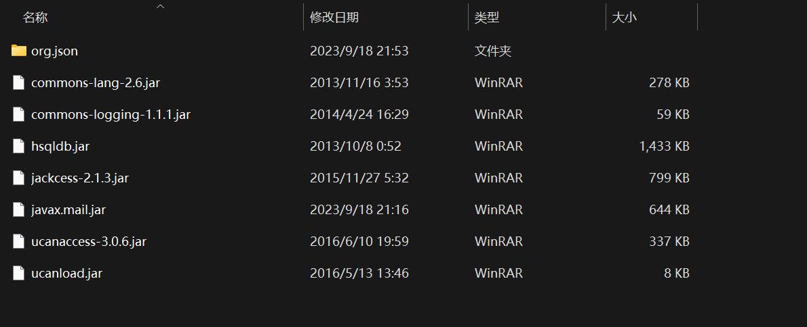

# SEU-CSE-VCampus
This Project is made by seven students in 2023's summer school.

Following are the students who mainly is responsible for the codes.

Other five students(mainly refers to who is responsible for coding) are as followed:
[HankCaptain](https://gitee.com/hankcaptain) and [缪缪的dog](https://gitee.com/f0uR51) are mainly responsible for the frontend's development.

[yfyou](https://gitee.com/yfyou) and [wwb](https://gitee.com/wwb_WuHuuu) are mainly responsible for the backend's development.

Me and [刘瀚隆](https://gitee.com/Liuhanlong_admin) are mainly responsible for the database part's maintain and development.

And thanks for the beautiful images provided by ***我磕的cp是真的除非我是假的***.

# Instrustions for use
First you need to download the following jars.

After that, you need to add some basic info into the database(vCampus.accdb)(And pay attention that the id is unique, you can not add two items with the same id(in every table)).

Finally, you run the sever.java(in sever package), and then you run the LoginMainFrame.java(in view package) to run the whole application.

***Good Luck, hope you have a good day.***

 
